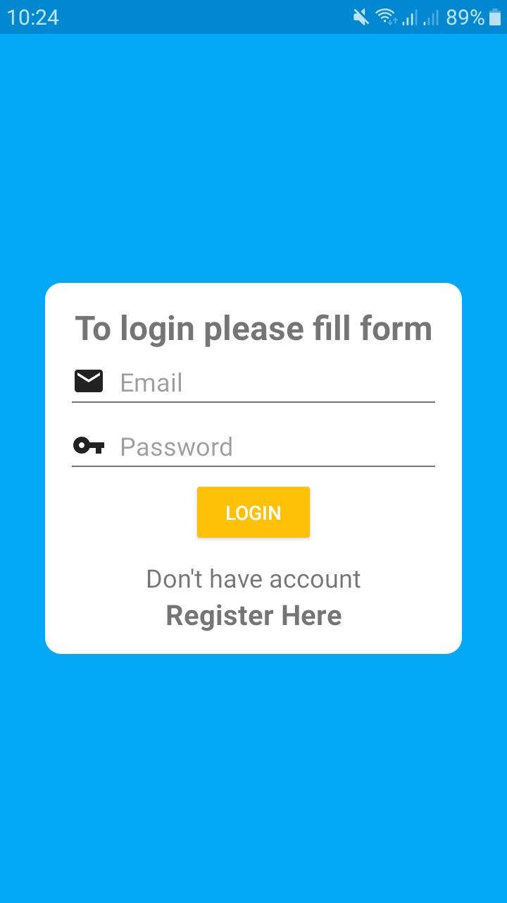
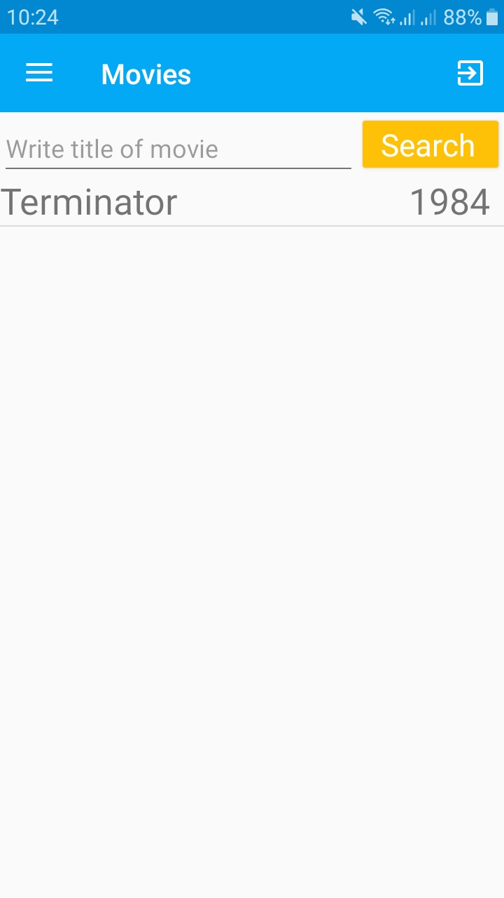
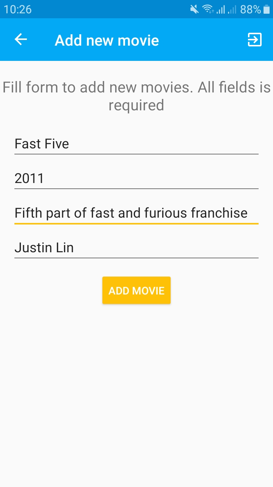
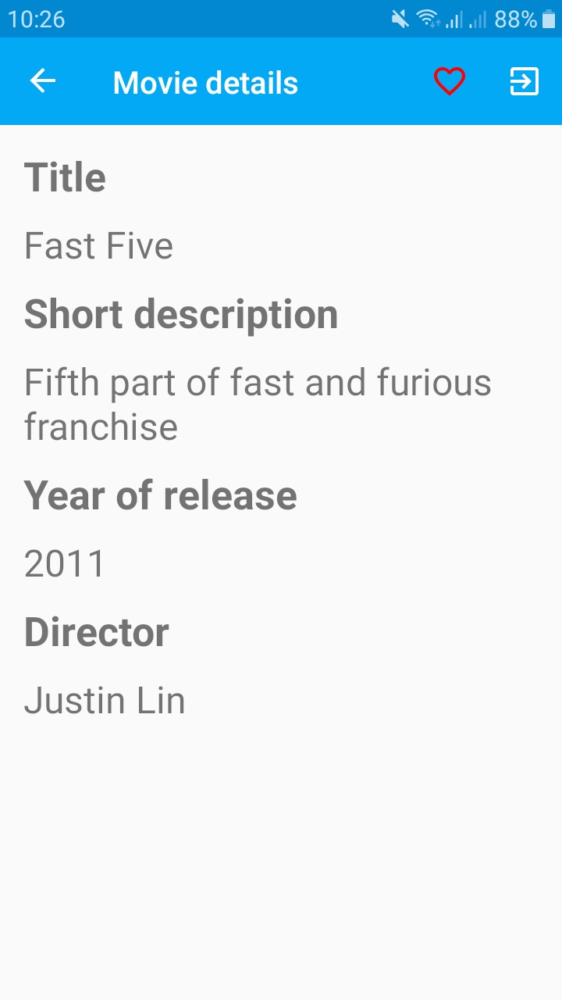

My Movie List is a simple application that allows the community to create a library of movies. An additional feature of the app is the ability to save movies to favorites. 
### About app

The application is a client for the database which is based on Firebase Realtime Database. The Firebase Authentication module has been used to manage accounts using the email + password option. The primary purpose of the application is to collect and use data about videos. Every user can browse information about film he/she has searched for. In case of lack of a movie the user has an option to add a movie. An additional option for the user is to save the found movie to favorites. 
### Features

My Movie List lets you:
- Create account with email and password
- Find information about movie
- Add information for missing movie
- Save movie to favorites

### Screenshots

|||||
|---|---|---|---|
### Libraries

- Firebase Authentication
- Firebase Realtime Database
- Navigation Component
- Livedata and Viewmodel
